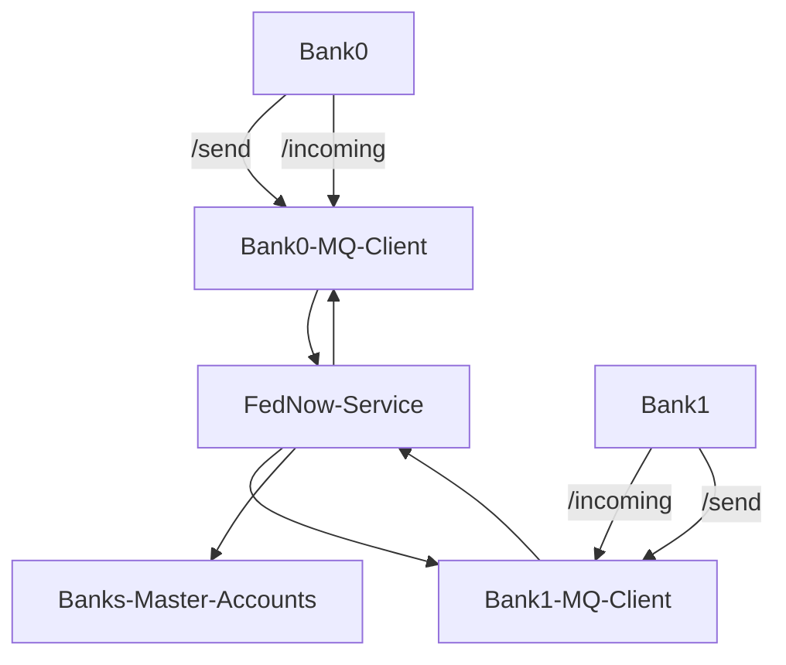

# ACH

## Table of contents

- [FRB, .ach, .ack](#frb-ach-ack)
- [How to start up the server](#how-to-start-up-the-server)
- [How to register a bank](#how-to-register-a-bank)
- [How to connect with your bank profile through SFTP](#how-to-connect-with-your-bank-profile-through-sftp)
- [SFTP overview](#sftp-overview)
- [How to manage banks SFTP accounts](#how-to-manage-banks-sftp-accounts)
- [Additional api](#additional-api)

## FRB, .ACH, .ACK

Default **FRB RTN: 090000515**

Default **FRB Legal name: FRB Tungsten**

 (You can change it in `.env` but it must be a valid rtn number)

RTN must
- Be a nine-digit number
- Number must follow this condition:
    - (3(d<sub>1</sub> + d<sub>4</sub> + d<sub>7</sub>) + 7(d<sub>2</sub> + d<sub>5</sub> + d<sub>8</sub>) + (d<sub>3</sub> + d<sub>6</sub> + d<sub>9</sub>)) mod 10 = 0
    - For example for our default FRB RTN `090000515`, the values are:
        -  (3(0 + 0 + 5) + 7(9 + 0 + 1) + (0 + 0 + 5))
        - (15 + 70 + 5) mod 10 = 90 mod 10 = 0

### .ACH

Example of .ACH file (you can use https://validator.ach-pro.com/ to highlight what each value means):
```
101 090000515 0401040122604050900A094101FRB Tungsten           Baguette Bank                  
5220Baguette store                      1313131310PPDLEEK PAY        260406   1040104010000001
62201010101239               0000015075               Leek store              0040104010000001
822000000100010101010000000000000000000150751313131310                         040104010000001
9000001000001000000010001010101000000000000000000015075                                       
9999999999999999999999999999999999999999999999999999999999999999999999999999999999999999999999
9999999999999999999999999999999999999999999999999999999999999999999999999999999999999999999999
9999999999999999999999999999999999999999999999999999999999999999999999999999999999999999999999
9999999999999999999999999999999999999999999999999999999999999999999999999999999999999999999999
9999999999999999999999999999999999999999999999999999999999999999999999999999999999999999999999
```
File has `.ach` extension.

After each session banks will recive `.ach` file in `outbound` directory containing transactions directed to them or their clients.

When sending files to ACH network, immediate destination will be FRB(federal reserve bank) and immediate origin will be your bank. In return `.ach` files this will be switched.

Guide: https://achdevguide.nacha.org/ach-file-overview

### .ACK

Example of `.ack` file (this is what bank will get after `.ach` is checked, name will be the same as `.ach` but with `.ack` extension instead. Uploded into banks `inbound` folder)

- Successful
    - [FH] -> header line:
        1. 1 - Formatting version
        2. LIVE - current environment
        3. {File ID Modifier} - File ID Modifier from ach file header (pos. 34)
    - [R] -> record line:
        1. 2 - no. blocks of 10
        2. 20 - number of lines (2 blocks * 10 lines)
```
FH,1,LIVE,{File ID Modifier}
R,2,20
```

- Failed formatting:
    - [FH] -> header line:
        1. 1 - Formatting version
        2. LIVE - current environment
        3. {File ID Modifier} - File ID Modifier from ach file header (pos. 34)
    - [E] -> Error line:
        1. F - Formatting error
        2. 0 - line where error occurred
        3. 9999 - error code
```
FH,1,LIVE,{File ID Modifier}
E,F,0,9999,File is incomplete or unreadable
```

- Line error:
    - [FH] -> header line:
        1. 1 - Formatting version
        2. LIVE - current environment
        3. {File ID Modifier} - File ID Modifier from ach file header (pos. 34)
    - [E] -> Error line:
        1. L - Line error
        2. 5 - line where error occurred
        3. 5000 - Error code
```
FH,1,LIVE,{File ID Modifier}
E,L,5,5000,Invalid Account
E,L,6,5000,Invalid Account
```

## How to start up the server

Prerequisites:
- Python (3.14)
- Docker
- ssh-keygen (Usually included with git for windows, test `ssh-keygen` in terminal)

1. (Only once) Open `.env` and fill in:
    - Postgres data
    - Banks SFTP accounts (Change the names to what you want or leave as is) (for adding or removing banks see [How to manage banks SFTP accounts](#how-to-manage-banks-sftp-accounts)) (Having more SFTP accounts than banks isn't a problem, for a bank to use ACH network a separate registration is required)

2. Start `start.bat` and select option 1. Generate SFTP keys (if not yet generated)

3. Start docker engine(Can by started by running docker desktop).

4. Start `start.bat` and select option 2. Start all services, or run `docker-compose up --build` from `./FedSystems`

## How to register a bank

0. Start the server [How to start up the server](#how-to-start-up-the-server)
1. Go to frontend control panel (default url is http://localhost:3310/ `REACT_PORT` in `.env`)
2. You should see `Fed Systems Dashboard` with a list of SFTP users.
3. In registered banks click `register new bank` and fill in the data.

## How to connect with your bank profile through SFTP

Your keys are in `FedSystems/SFTP_Keys/{yourbank sftp username}`

`id_rsa.pub` is your public key and has to stay in `/SFTP_Keys` folder, to be mounted in SFTP container.

`id_rsa` is your private key, use this to log into your SFTP account.

You can check sftp connection through filezilla or any SFTP client using the following connection details:
- Host: localhost
- Port: default 2221 (`SFTP_ACH_HOST_PORT` in `.env`)
- Username: (one of the bank names you set in the `.env` file, e.g. baguette-bank)
- Authentication: Use the corresponding private key from the `SFTP_Keys` directory that was generated by the script. Folder name is same as username.
- Alternatively, you can connect through command line or a dedicated library in your code. (e.g. paramiko for python)

Example of connection through command line:

```bash
sftp -oStrictHostKeyChecking=no -i id_rsa -P 2221 baguette-bank@localhost
```
- add `-oStrictHostKeyChecking=no` to avoid problems when host public key changes.
- `-i id_rsa` is your private key from `/SFTP_Keys`
- `-P 2221` is port `2221`
- `baguette-bank@localhost` `baguette-bank` username from `.env.example` and host

### SFTP overview

In your bank account SFTP home directory you'll find:
- `inbound` directory - This is where you leave your .ach files
- `outbound` directory - This is where you can find .ach and .ack files directed to you

## How to manage banks SFTP accounts

### How to add a new SFTP user

1. Add a new `.env` variable (increment) like:
```python
BANK0 = "baguette-bank"
BANK1 = "leek-bank"
BANK2 = "bank-of-the-onion"
BANK3 = "croissant-bank"
BANK4 = "new-bank" # <--- New bank
```

2. Add a new entries in 'docker-compose.yml' by adding
    - `- ./SFTP_Keys/${BANK4}/id_rsa.pub:/home/${BANK4}/.ssh/keys/id_rsa.pub:ro` to sftp volumes. There are 2 variables to change in this line: `SFTP_Keys/${BANK4}` and `home/${BANK4}` 
    - `${BANK4}::1004:1004:inbound,outbound` to envirement `SFTP_USERS` variable, separated by spaces, `1004:1004` increment by 1
```yml
volumes:
# Add new bank volumes here: ./SFTP_Keys/<name>/id_rsa.pub:/home/<username>/.ssh/keys/id_rsa.pub:ro
      - sftp_data:/home
      - ./SFTP_Keys/${BANK0}/id_rsa.pub:/home/${BANK0}/.ssh/keys/id_rsa.pub:ro
      - ./SFTP_Keys/${BANK1}/id_rsa.pub:/home/${BANK1}/.ssh/keys/id_rsa.pub:ro
      - ./SFTP_Keys/${BANK2}/id_rsa.pub:/home/${BANK2}/.ssh/keys/id_rsa.pub:ro
      - ./SFTP_Keys/${BANK3}/id_rsa.pub:/home/${BANK3}/.ssh/keys/id_rsa.pub:ro
      - ./SFTP_Keys/${BANK4}/id_rsa.pub:/home/${BANK4}/.ssh/keys/id_rsa.pub:ro
      - ./sftp_set_perms.sh:/etc/sftp.d/set_perms.sh:ro
environment:
# Add new banks here: <username>::<uid>:<gid>:inbound,outbound
    - SFTP_USERS=${BANK0}::1000:1000:inbound,outbound ${BANK1}::1001:1001:inbound,outbound ${BANK2}::1002:1002:inbound,outbound ${BANK3}::1003:1003:inbound,outbound ${BANK4}::1004:1004:inbound,outbound
```

3. Regenerate the keys

### How to remove an SFTP user

1. Remove an `.env` variable(make sure numbers are 0 -> n) like:
```python
BANK0 = "baguette-bank"
BANK1 = "leek-bank"
BANK2 = "bank-of-the-onion"
BANK3 = "croissant-bank"
# BANK4 = "new-bank" <--- Removed bank
```

2. Remove entries in 'docker-compose.yml' by removing the 
    - `- ./SFTP_Keys/${BANK4}/id_rsa.pub:/home/${BANK3}/.ssh/keys/id_rsa.pub:ro` to sftp volumes
    - `${BANK4}::1004:1004:inbound,outbound` to envirement `SFTP_USERS` variable, separated by spaces, `1004:1004` increment by 1
```yml
volumes:
# Add new bank volumes here: ./SFTP_Keys/<name>/id_rsa.pub:/home/<username>/.ssh/keys/id_rsa.pub:ro
      - sftp_data:/home
      - ./SFTP_Keys/${BANK0}/id_rsa.pub:/home/${BANK0}/.ssh/keys/id_rsa.pub:ro
      - ./SFTP_Keys/${BANK1}/id_rsa.pub:/home/${BANK1}/.ssh/keys/id_rsa.pub:ro
      - ./SFTP_Keys/${BANK2}/id_rsa.pub:/home/${BANK2}/.ssh/keys/id_rsa.pub:ro
      - ./SFTP_Keys/${BANK3}/id_rsa.pub:/home/${BANK3}/.ssh/keys/id_rsa.pub:ro
      - ./SFTP_Keys/${BANK4}/id_rsa.pub:/home/${BANK3}/.ssh/keys/id_rsa.pub:ro
      - ./sftp_set_perms.sh:/etc/sftp.d/set_perms.sh:ro
environment:
# Add new banks here: <username>::<uid>:<gid>:inbound,outbound
    - SFTP_USERS=${BANK0}::1000:1000:inbound,outbound ${BANK1}::1001:1001:inbound,outbound ${BANK2}::1002:1002:inbound,outbound ${BANK3}::1003:1003:inbound,outbound ${BANK4}::1004:1004:inbound,outbound
```

You don't need to keys regenerate here.

## Additional api

With default `.env.example`:

Backend api docs can be found at (http://localhost:8310/docs)

Frontend panel available at (http://localhost:3310/)

SFTP server at (localhost:2221)

Postgres database at (localhost:5439):
- Username: postgres
- Password: Password123
- Database: fed_systems_db

# FedNow

## Table of contents

## System flow chart overview



To communicate with FedNow service use **dedicated client (for example Bank0-MQ-Client in chart above)** instead of direct connection.

## How to access your dedicated client

1. In `.env` select one bank as yours, you can change name, port and RTN(must be a valid RTN)
2. Connect to your selected client with http://localhost:{MQ_BANK_PORT}
    - Example for:
    ```
        BANK0 = "baguette-bank"
        BANK1 = "leek-bank"
        BANK2 = "bank-of-the-onion"
        BANK3 = "croissant-bank"

        BANK0_RTN = "040104018"
        BANK1_RTN = "010101012"
        BANK2_RTN = "910310314"
        BANK3_RTN = "514310008"

        MQ_BANK0_PORT = 8770
        MQ_BANK1_PORT = 8771
        MQ_BANK2_PORT = 8772
        MQ_BANK3_PORT = 8773
    ```
    If you select your bank to be `BANK0` you'd have **RTN: 040104018** and your FedNow client would be accessible via http://localhost:8770

    Encryption is handled internally between client and FedNow system.

    You can find API documentation at http://localhost:8770/docs after starting docker FedSystems docker.
    
    Clients are built at start so pre-registration is required.

## FedNow Api

You should connect to your dedicated client (http://localhost:8770 in example above) not directly.

Replace port 8770 with port for your selected bank.

API also available at  http://localhost:8770/docs

- http://localhost:8770/send - `POST`, accepts xml files. This is where you'd send any files you want to send to FedNow service.
- http://localhost:8770/incoming - Lists incoming files
- http://localhost:8770/incoming/{filename} - Downloads incoming file
- http://localhost:8770/mark-failed/{filename} - Allows you to clear file from incoming to failed directory
- http://localhost:8770/mark-collected/{filename} - Allows you to clear file from incoming to collected directory
- http://localhost:8770/collected - Lists collected files (Used mainly for archiving)
- http://localhost:8770/collected/{filename} - Allows you to download file from collected directory (Used mainly for archiving)
- http://localhost:8770/FIFO/out - If no files are available in queue returns `404 - No files in queue`, if files are in queue returns oldest file, and removes file from queue. Files are moved to `/collected` for possible recovery.

### How to send file

- Use http://localhost:8770/send - `POST`, accepts xml files. This is where you'd send any files you want to send to FedNow service.
- Files are automatically renamed to {BANK_RTN}_DATE_TIME_XXXX.xml"

### How to recive file
- Method 1:
    - Use http://localhost:8770/FIFO/out - If no files are available in queue returns `404 - No files in queue`, if files are in queue returns oldest file, and removes file from queue. Files are moved to `/collected` for possible recovery.
- Method 2:
    - Use http://localhost:8770/incoming/{filename} to fetch specific file from incoming.
    - Requires user to manually track files and move files out of queue with http://localhost:8770/mark-failed/{filename} or http://localhost:8770/mark-collected/{filename}

# RTP System

## Table of contents
- [Project Overview](#project-overview)
- [How to start the system](#how-to-start-the-system)
- [Authentication](#authentication)
- [RTP Payment Flow](#rtp-payment-flow)
- [Gridlock & Netting Mechanism](#gridlock-mechanism)
- [API Endpoints](#api-endpoints)
- [Database Models](#database-models)

---

# Project overview

This project is a simplified simulation of an American **Real-Time Payments (RTP)** settlement system created for university purposes.

The system allows banks to:

- register in the RTP network,
- authenticate using API keys,
- send ISO 20022 payment messages,
- settle transactions in real time,
- queue transactions during liquidity shortages,
- resolve payment gridlocks through netting,
- inject liquidity from the central bank,
- monitor balances and transaction history.

The application is built using:

- FastAPI
- PostgreSQL
- SQLAlchemy
- Docker

---

# Technologies

## Backend

- Python 3.11
- FastAPI
- SQLAlchemy
- Uvicorn

## Database

- PostgreSQL

## Containerization

- Docker

## Messaging standard

- ISO 20022 XML

---

# System architecture

The project consists of:

| Component | Description |
|---|---|
| `main.py` | Main FastAPI application |
| `routers.py` | API endpoints and RTP logic |
| `database.py` | Database models and configuration |
| `schemas.py` | Pydantic request schemas |
| `Dockerfile` | Container definition |
| PostgreSQL | Persistent data storage |

---

# Database structure

The system uses four main database tables:

| Table | Purpose |
|---|---|
| `banks` | Registered RTP participants |
| `transactions` | Processed transactions |
| `gridlock_queue` | Queued transactions |
| `netting_reports` | Netting settlement reports |

---

## How to start the system

### Prerequisites
- Docker

### Launching the application

To start the entire system (database, backend, and frontend), use a single command in the project's root directory:
```bash
docker-compose up --build
```

To clear all the data use:
```bash
docker-compose down -v
```
---

# Interactive API documentation

Swagger UI:

```text
http://localhost:8000/docs
```

---

# GUI

The GUI is available at:

```text
http://localhost:3000
```

---

# Authentication

The RTP system uses API Key authentication.
Every protected request must include api key.

Example:

```http
x-api-key: key-d4e5f6a7b8c9d0e1
```

If the API key is invalid, the system returns:

```json
{
  "detail": "Invalid or missing API Key."
}
```

---

# Bank onboarding process

## Register bank

Banks must first register in the RTP system.

### Request

```http
POST /banks
Content-Type: application/json
```

### Request body

```json
{
  "bank_code": "BANKC",
  "balance": 10000,
  "debt_limit": 5000
}
```

### Response

```json
{
  "message": "Bank BANKC registered successfully.",
  "api_key": "key-d4e5f6a7b8c9d0e1"
}
```

The generated API key should be stored securely by the bank.

---

## Send RTP transfers

Banks send ISO 20022 XML messages to:

```http
POST /transfer
```

The RTP system validates and processes the transfer in real time.

---

# ISO 20022 payment format

The system accepts simplified ISO 20022 XML payment messages.

## Required XML fields

| Field | Description |
|---|---|
| `MsgId` | Message identifier |
| `EndToEndId` | Transaction identifier |
| `IntrBkSttlmAmt` | Settlement amount |
| `DbtrAgt` | Sender bank |
| `CdtrAgt` | Receiver bank |

---

# RTP payment flow

## Standard transfer flow

1. Bank creates ISO 20022 XML message.
2. Bank sends request to:

```http
POST /transfer
```

3. Request must contain:

```http
Content-Type: application/xml
x-api-key
```

4. RTP system validates:
   - XML structure,
   - sender authentication,
   - receiver existence,
   - duplicate transactions,
   - liquidity availability,
   - supported currency.

5. If funds are available:
   - sender balance decreases,
   - receiver balance increases,
   - transaction is settled instantly.

6. RTP system returns settlement response.

7. Bank application should update customer transaction state.

---

# Gridlock mechanism

If a bank does not have enough liquidity:

- transaction is added to `gridlock_queue`,
- transaction receives `GRIDLOCK_QUEUED` status,
- bank may eventually become blocked.

Queued transactions may later be settled through netting.

---

## Netting process

The `/gridlock-resolve` endpoint:

1. Calculates net positions for all queued payments.
2. Checks whether all banks remain within debt limits.
3. If possible:
   - balances are updated,
   - queued transactions are settled,
   - queue is cleared,
   - netting reports are generated.

---

# Liquidity timeout logic

If a bank exceeds its liquidity limit and does not recover within 60 seconds:

- bank status changes to `BLOCKED`,
- further transfers are rejected.

Bank liquidity can later be restored using:

```http
POST /central-bank/inject
```

---

# Bank statuses

| Status | Description |
|---|---|
| `ACTIVE` | Bank can send transactions |
| `BLOCKED` | Bank exceeded liquidity limits |

---

# API endpoints

# Health check

## GET `/`

Returns RTP system status.

### Response

```json
{
  "message": "RTP system works"
}
```

---

# Bank management

## POST `/banks`

Registers a new bank.

---

## POST `/banks/{bank_code}/reset-key`

Resets API key for selected bank.

---

## PATCH `/banks/{bank_code}/status`

Updates bank status.

### Example request

```json
{
  "status": "BLOCKED"
}
```

---

## GET `/banks`

Returns balances, debt limits, and statuses of all banks.

---

# Transactions

## POST `/transfer`

Processes RTP transfer.

### Required headers

```http
Content-Type: application/xml
api key:
```

---

## GET `/transactions`

Returns latest 50 transactions.

---

## GET `/queue`

Returns queued gridlock transfers.

---

# Netting

## POST `/gridlock-resolve`

Attempts to resolve queued transactions.

### Example response

```json
{
  "status": "SUCCESS",
  "message": "Settled 3 queued transfers."
}
```

---

## GET `/netting-reports`

Returns generated netting reports.

---

# Central bank operations

## POST `/central-bank/inject`

Injects liquidity into selected bank.

### Example request

```json
{
  "bank_code": "BANKA",
  "amount": 50000
}
```

### Example response

```json
{
  "status": "RESTORED",
  "message": "Liquidity restored for BANKA."
}
```

---

# Example requests

# Example RTP transfer request

---

## Example XML file

```xml
<Document xmlns="urn:iso:std:iso:20022:tech:xsd:pacs.008.001.08">
  <FIToFICstmrCdtTrf>
    <GrpHdr>
      <MsgId>MSG-TEST-002</MsgId>
    </GrpHdr>
    <CdtTrfTxInf>
      <PmtId>
         <EndToEndId>E2E-TEST-002</EndToEndId>
      </PmtId>
      
      <IntrBkSttlmAmt Ccy="USD">500.00</IntrBkSttlmAmt>
      
      <DbtrAgt>
         <FinInstnId>
            <ClrSysMmbId><MmbId>BANKA</MmbId></ClrSysMmbId>
         </FinInstnId>
      </DbtrAgt>
      <Dbtr>
         <Nm>Jan Kowalski</Nm>
      </Dbtr>
      <DbtrAcct>
         <Id>
            <Othr><Id>1234567890</Id></Othr>
         </Id>
      </DbtrAcct>

      <CdtrAgt>
         <FinInstnId>
            <ClrSysMmbId><MmbId>BANKB</MmbId></ClrSysMmbId>
         </FinInstnId>
      </CdtrAgt>
      <Cdtr>
         <Nm>Sklep Internetowy XYZ</Nm>
      </Cdtr>
      <CdtrAcct>
         <Id>
            <Othr><Id>0987654321</Id></Othr>
         </Id>
      </CdtrAcct>

    </CdtTrfTxInf>
  </FIToFICstmrCdtTrf>
</Document>
```

---

# RTP response statuses

| Status | Description |
|---|---|
| `ACCEPTED` | Transaction settled successfully |
| `GRIDLOCK_QUEUED` | Transaction queued due to insufficient liquidity |
| `REJECTED` | Bank is blocked |
| `DUPLICATE` | Duplicate transaction detected |

---

## Successful settlement

```json
{
  "status": "ACCEPTED",
  "message": "Settlement completed."
}
```

---

## Insufficient liquidity

```json
{
  "status": "GRIDLOCK_QUEUED",
  "code": "AM04",
  "message": "Insufficient funds",
  "queue_size": 2
}
```

---

## Blocked bank

```json
{
  "status": "REJECTED",
  "code": "AM03",
  "message": "Blocked account"
}
```

---

## Duplicate transfer

```json
{
  "status": "DUPLICATE",
  "code": "DU01",
  "message": "Duplicate payment"
}
```

---

# Error codes

The project implements simplified ISO 20022 error handling.

| Code | Meaning |
|---|---|
| `AM04` | Insufficient funds |
| `AM03` | Blocked account |
| `AC03` | Invalid creditor account |
| `DU01` | Duplicate payment |

---

# Database models

# Bank

| Field | Type |
|---|---|
| bank_code | String |
| balance | Float |
| debt_limit | Float |
| status | String |
| limit_exceeded_at | DateTime |
| api_key | String |

---

# Transaction

| Field | Type |
|---|---|
| id | Integer |
| sender_code | String |
| receiver_code | String |
| amount | Float |
| status | String |
| message_id | String |
| timestamp | DateTime |
| debtor_name | String |
| debtor_account | String |
| creditor_name | String |
| creditor_account | String | 

---

# GridlockQueue

| Field | Type |
|---|---|
| id | Integer |
| xml_payload | String |
| added_at | DateTime |

---

# NettingReport

| Field | Type |
|---|---|
| id | Integer |
| session_id | String |
| bank_code | String |
| net_position | Float |
| status | String |
| timestamp | DateTime |

---

