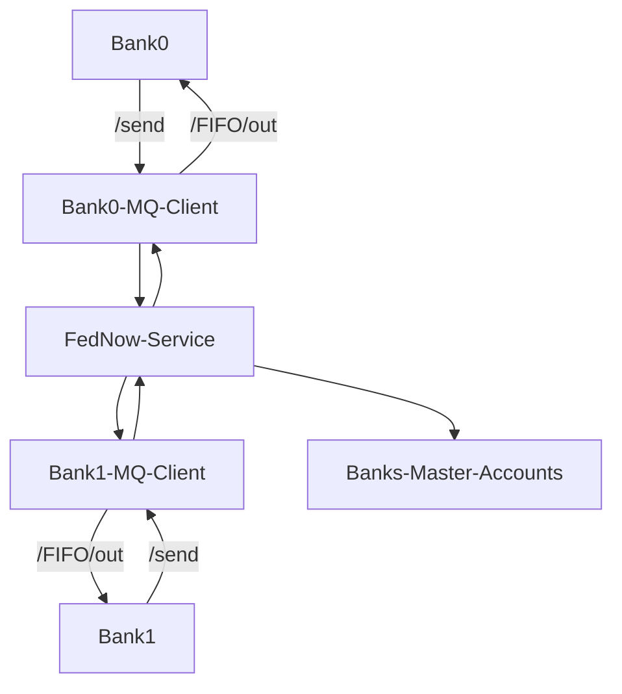

# ACH

## Table of contents

- [FRB, .ach, .ack](#frb-ach-ack)
- [How to start up the server](#how-to-start-up-the-server)
- [How to register a bank](#how-to-register-a-bank)
- [How to connect with your bank profile through SFTP](#how-to-connect-with-your-bank-profile-through-sftp)
- [SFTP overview](#sftp-overview)
- [How to manage banks SFTP accounts](#how-to-manage-banks-sftp-accounts)
- [Additional api](#additional-api)

- [How to integrate: Step-by-step guide](#how-to-integrate-step-by-step-guide)
- [Helpers](#helpers)
- [Sessions](#sessions)

## FRB, .ACH, .ACK

Default **FRB RTN: 090000515**

Default **FRB Legal name: FRB Tungsten**

 (You can change it in `.env` but it must be a valid rtn number)

RTN must
- Be a nine-digit number
- Number must follow this condition:
    - (3(d<sub>1</sub> + d<sub>4</sub> + d<sub>7</sub>) + 7(d<sub>2</sub> + d<sub>5</sub> + d<sub>8</sub>) + (d<sub>3</sub> + d<sub>6</sub> + d<sub>9</sub>)) mod 10 = 0
    - For example for our default FRB RTN `090000515`, the values are:
        -  (3(0 + 0 + 5) + 7(9 + 0 + 1) + (0 + 0 + 5))
        - (15 + 70 + 5) mod 10 = 90 mod 10 = 0

### .ACH

Example of .ACH file (you can use https://validator.ach-pro.com/ to highlight what each value means):
```
101 090000515 0401040122604050900A094101FRB Tungsten           Baguette Bank                  
5220Baguette store                      1313131310PPDLEEK PAY        260406   1040104010000001
62201010101239               0000015075               Leek store              0040104010000001
822000000100010101010000000000000000000150751313131310                         040104010000001
9000001000001000000010001010101000000000000000000015075                                       
9999999999999999999999999999999999999999999999999999999999999999999999999999999999999999999999
9999999999999999999999999999999999999999999999999999999999999999999999999999999999999999999999
9999999999999999999999999999999999999999999999999999999999999999999999999999999999999999999999
9999999999999999999999999999999999999999999999999999999999999999999999999999999999999999999999
9999999999999999999999999999999999999999999999999999999999999999999999999999999999999999999999
```
File has `.ach` extension.

After each session banks will recive `.ach` file in `outbound` directory containing transactions directed to them or their clients.

When sending files to ACH network, immediate destination will be FRB(federal reserve bank) and immediate origin will be your bank. In return `.ach` files this will be switched.

Guide: https://achdevguide.nacha.org/ach-file-overview

### .ACK

Example of `.ack` file (this is what bank will get after `.ach` is checked, name will be the same as `.ach` but with `.ack` extension instead. Uploded into banks `inbound` folder)

- Successful
    - [FH] -> header line:
        1. 1 - Formatting version
        2. LIVE - current environment
        3. {File ID Modifier} - File ID Modifier from ach file header (pos. 34)
    - [R] -> record line:
        1. 2 - no. blocks of 10
        2. 20 - number of lines (2 blocks * 10 lines)
```
FH,1,LIVE,{File ID Modifier}
R,2,20
```

- Failed formatting:
    - [FH] -> header line:
        1. 1 - Formatting version
        2. LIVE - current environment
        3. {File ID Modifier} - File ID Modifier from ach file header (pos. 34)
    - [E] -> Error line:
        1. F - Formatting error
        2. 0 - line where error occurred
        3. 9999 - error code
```
FH,1,LIVE,{File ID Modifier}
E,F,0,9999,File is incomplete or unreadable
```

- Line error:
    - [FH] -> header line:
        1. 1 - Formatting version
        2. LIVE - current environment
        3. {File ID Modifier} - File ID Modifier from ach file header (pos. 34)
    - [E] -> Error line:
        1. L - Line error
        2. 5 - line where error occurred
        3. 5000 - Error code
```
FH,1,LIVE,{File ID Modifier}
E,L,5,5000,Invalid Account
E,L,6,5000,Invalid Account
```

## How to start up the server

Prerequisites:
- Python (3.14)
- Docker
- ssh-keygen (Usually included with git for windows, test `ssh-keygen` in terminal)

0. (Only once) copy `.env.example` to `.env`

```bash
copy .env.example .env
```
or
```bash
cp .env.example .env
```

1. (Only once) Open `.env` and edit parts you want to change (instead of creating a new bank, edit the existing ones. For new bank creation look at [How to manage banks SFTP accounts](#how-to-manage-banks-sftp-accounts)):
    ```python
    AUTOMATED_CONFIG=true # Allows banks automated setup.

    MQ_BANK0_PORT = 8770 # Port for your FedNoW MQ Client
    BANK0 = "baguette-bank" # SFTP username for Bank 0 (must be lowercase and use '-' instead of spaces)
    BANK0_RTN = "040104018" # RTN must be a valid one, check readme for details.
    BANK0_MRTN = "040104018" # Master RTN, usally the same as RTN but can differ for some banks (When multiple banks share the same master account)
    BANK0_LEGAL_NAME = "Baguette Bank"
    BANK0_FEIN = "123456789" # 9 digit Federal Employer Identification Number (it's not the same as RTN)
    BANK0_NET_DEBIT_CAP = 100000000 # Optional: Set a net debit cap for this bank in cents (e.g., 100000000 for $1,000,000.00). If not set, there will be no cap.
    BANK0_INITIAL_BALANCE = 1000000000 # Optional: Set an initial balance for this bank in cents (e.g., 1000000000 for $10,000,000.00). If not set, the bank will start with a zero balance.
    ```

2. Start `start.bat` and select option 1. Generate SFTP keys (if not yet generated) or run:
    ```bash
    python generate_keys.py
    ```

3. Start docker engine(Can by started by running docker desktop).

4. Start `start.bat` and select option 2. Start all services, or run `docker-compose up --build` from `./FedSystems` or run:

    ```bash
    docker-compose up --build
    ```

## How to register a bank

If automated setup(inside `.env`) is enabled this will be done automatically on first start-up.

0. Start the server [How to start up the server](#how-to-start-up-the-server)
1. Go to frontend control panel (default url is http://localhost:3310/ `REACT_PORT` in `.env`)
2. You should see `Fed Systems Dashboard` with a list of SFTP users.
3. In registered banks click `register new bank` and fill in the data.

## How to connect with your bank profile through SFTP

Your keys are in `FedSystems/SFTP_Keys/{yourbank sftp username}`

`id_rsa.pub` is your public key and has to stay in `/SFTP_Keys` folder, to be mounted in SFTP container.

`id_rsa` is your private key, use this to log into your SFTP account.

You can check sftp connection through filezilla or any SFTP client using the following connection details:
- Host: localhost
- Port: default 2221 (`SFTP_ACH_HOST_PORT` in `.env`)
- Username: (one of the bank names you set in the `.env` file, e.g. baguette-bank)
- Authentication: Use the corresponding private key from the `SFTP_Keys` directory that was generated by the script. Folder name is same as username.
- Alternatively, you can connect through command line or a dedicated library in your code. (e.g. paramiko for python)

Example of connection through command line:

```bash
sftp -oStrictHostKeyChecking=no -i id_rsa -P 2221 baguette-bank@localhost
```
- add `-oStrictHostKeyChecking=no` to avoid problems when host public key changes.
- `-i id_rsa` is your private key from `/SFTP_Keys`
- `-P 2221` is port `2221`
- `baguette-bank@localhost` `baguette-bank` username from `.env.example` and host

### SFTP overview

In your bank account SFTP home directory you'll find:
- `inbound` directory - This is where you leave your .ach files
- `outbound` directory - This is where you can find .ach and .ack files directed to you

## How to manage banks SFTP accounts

### How to add a new SFTP user

1. Add a new `.env` variable (increment) like:
```python
MQ_BANK6_PORT = 8776 # <-- Required, Bank0 = 8770, Bank1 = 8771 ... Bank6 = 8776
BANK6 = "new-bank" # <-- Required (lowercase and '-' instead of spaces)
BANK6_RTN = "666777667"  # <-- (Required if automated_config is true)
BANK6_MRTN = "666777667" # <-- (Required if automated_config is true)
BANK6_LEGAL_NAME = "New Bank" # <-- (Required if automated_config is true)
BANK6_FEIN = "333333333" # <-- (Required if automated_config is true)
BANK6_NET_DEBIT_CAP = 100000000 # <-- (Required if automated_config is true)
BANK6_INITIAL_BALANCE = 1000000000 # <-- (Required if automated_config is true)
```

2. Add a new entries in 'docker-compose.yml' by adding
    - `- ./SFTP_Keys/${BANK6}/id_rsa.pub:/home/${BANK6}/.ssh/keys/id_rsa.pub:ro` to sftp volumes. There are 2 variables to change in this line: `SFTP_Keys/${BANK6}` and `home/${BANK6}` 
    - `${BANK6}::1006:1006:inbound,outbound` to envirement `SFTP_USERS` variable, separated by spaces, `1006:1006` increment by 1
```yml
volumes:
# Add new bank volumes here: ./SFTP_Keys/<name>/id_rsa.pub:/home/<username>/.ssh/keys/id_rsa.pub:ro
      - sftp_data:/home
      - ./SFTP_Keys/${BANK0}/id_rsa.pub:/home/${BANK0}/.ssh/keys/id_rsa.pub:ro
      - ./SFTP_Keys/${BANK1}/id_rsa.pub:/home/${BANK1}/.ssh/keys/id_rsa.pub:ro
      - ./SFTP_Keys/${BANK2}/id_rsa.pub:/home/${BANK2}/.ssh/keys/id_rsa.pub:ro
      - ./SFTP_Keys/${BANK3}/id_rsa.pub:/home/${BANK3}/.ssh/keys/id_rsa.pub:ro
      - ./SFTP_Keys/${BANK4}/id_rsa.pub:/home/${BANK4}/.ssh/keys/id_rsa.pub:ro
      - ./SFTP_Keys/${BANK5}/id_rsa.pub:/home/${BANK5}/.ssh/keys/id_rsa.pub:ro
      - ./SFTP_Keys/${BANK6}/id_rsa.pub:/home/${BANK6}/.ssh/keys/id_rsa.pub:ro
      - ./sftp_set_perms.sh:/etc/sftp.d/set_perms.sh:ro
environment:
# Add new banks here: <username>::<uid>:<gid>:inbound,outbound
    - SFTP_USERS=${BANK0}::1000:1000:inbound,outbound ${BANK1}::1001:1001:inbound,outbound ${BANK2}::1002:1002:inbound,outbound ${BANK3}::1003:1003:inbound,outbound ${BANK4}::1004:1004:inbound,outbound ${BANK5}::1004:1004:inbound,outbound ${BANK6}::1004:1004:inbound,outbound 
```

3. Regenerate the keys

4. Add a new bank information in `ACH/main.py` (If used with automated setup)
```python
BANK5 = os.environ.get("BANK6", "coffee-bank")
BANK5_RTN = os.environ.get("BANK6_RTN", "666777667")
BANK5_MRTN = os.environ.get("BANK6_MRTN", BANK5_RTN)
BANK5_LEGAL_NAME = os.environ.get("BANK6_LEGAL_NAME", "Coffee Bank")
BANK5_FEIN = os.environ.get("BANK6_FEIN", "333333333")
BANK5_NET_DEBIT_CAP = int(os.environ.get("BANK6_NET_DEBIT_CAP", "100000000"))
BANK5_INITIAL_BALANCE = int(os.environ.get("BANK6_INITIAL_BALANCE", "1000000000"))

BANK_SEED_CONFIGS = [
  # ... 
  {
      "primary_routing_transit_number": BANK6_RTN,
      "legal_name": BANK6_LEGAL_NAME,
      "federal_employer_identification_number": BANK6_FEIN,
      "master_account_rtn": BANK6_MRTN,
      "net_debit_cap": BANK6_NET_DEBIT_CAP,
      "sftp_username": BANK6,
      "server_certificate_expiry": None,
      "initial_balance": BANK6_INITIAL_BALANCE,
  }
  # ...
]
```

### How to remove an SFTP user

1. Remove an `.env` variable(make sure numbers are 0 -> n) like:
```python
BANK0 = "baguette-bank"
BANK1 = "leek-bank"
BANK2 = "bank-of-the-onion"
BANK3 = "croissant-bank"
# BANK4 = "new-bank" <--- Removed bank
```

2. Remove entries in 'docker-compose.yml' by removing the 
    - `- ./SFTP_Keys/${BANK4}/id_rsa.pub:/home/${BANK3}/.ssh/keys/id_rsa.pub:ro` to sftp volumes
    - `${BANK4}::1004:1004:inbound,outbound` to envirement `SFTP_USERS` variable, separated by spaces, `1004:1004` increment by 1
```yml
volumes:
# Add new bank volumes here: ./SFTP_Keys/<name>/id_rsa.pub:/home/<username>/.ssh/keys/id_rsa.pub:ro
      - sftp_data:/home
      - ./SFTP_Keys/${BANK0}/id_rsa.pub:/home/${BANK0}/.ssh/keys/id_rsa.pub:ro
      - ./SFTP_Keys/${BANK1}/id_rsa.pub:/home/${BANK1}/.ssh/keys/id_rsa.pub:ro
      - ./SFTP_Keys/${BANK2}/id_rsa.pub:/home/${BANK2}/.ssh/keys/id_rsa.pub:ro
      - ./SFTP_Keys/${BANK3}/id_rsa.pub:/home/${BANK3}/.ssh/keys/id_rsa.pub:ro
      - ./SFTP_Keys/${BANK4}/id_rsa.pub:/home/${BANK3}/.ssh/keys/id_rsa.pub:ro
      - ./sftp_set_perms.sh:/etc/sftp.d/set_perms.sh:ro
environment:
# Add new banks here: <username>::<uid>:<gid>:inbound,outbound
    - SFTP_USERS=${BANK0}::1000:1000:inbound,outbound ${BANK1}::1001:1001:inbound,outbound ${BANK2}::1002:1002:inbound,outbound ${BANK3}::1003:1003:inbound,outbound ${BANK4}::1004:1004:inbound,outbound
```

You don't need to keys regenerate here.

## Additional api

With default `.env.example`:

Backend api docs can be found at (http://localhost:8310/docs)

Frontend panel available at (http://localhost:3310/)

SFTP server at (localhost:2221)

MQ Clients:

- Bank0 = http://localhost:8770/docs
- Bank1 = http://localhost:8771/docs
- Bank2 = http://localhost:8772/docs
- Bank3 = http://localhost:8773/docs
- Bank4 = http://localhost:8774/docs
- Bank5 = http://localhost:8775/docs

Postgres database at (localhost:5439):
- Username: postgres
- Password: Password123
- Database: fed_systems_db

# How to integrate: Step-by-step guide

1. Clone repository
```bash
git clone https://github.com/VanillaMile/payment-settlement-systems.git
```
2. Open terminal inside `\FedSystems` directory
3. Copy `.env.example` into `.env`
```bash
copy .env.example .env
```
4. Open `.env` and edit bank details to your preferance:

Instead of creating a new bank details, edit the existing ones (BANK0, BANK1 ... BANK5). For creating a new bank registration look at [How to manage banks SFTP accounts](#how-to-manage-banks-sftp-accounts)
```python
AUTOMATED_CONFIG=true # Allows banks automated setup.

MQ_BANK0_PORT = 8770 # Port for your FedNoW MQ Client
BANK0 = "baguette-bank" # SFTP username for Bank 0 (must be lowercase and use '-' instead of spaces)
BANK0_RTN = "040104018" # RTN must be a valid one, check readme for details.
BANK0_MRTN = "040104018" # Master RTN, usally the same as RTN but can differ for some banks (When multiple banks share the same master account)
BANK0_LEGAL_NAME = "Baguette Bank"
BANK0_FEIN = "123456789" # 9 digit Federal Employer Identification Number (it's not the same as RTN)
BANK0_NET_DEBIT_CAP = 100000000 # Optional: Set a net debit cap for this bank in cents (e.g., 100000000 for $1,000,000.00). If not set, there will be no cap.
BANK0_INITIAL_BALANCE = 1000000000 # Optional: Set an initial balance for this bank in cents (e.g., 1000000000 for $10,000,000.00). If not set, the bank will start with a zero balance.
```

5. Run `start.bat` and select option `1.Generate SFTP keys` or run:
```bash
python generate_keys.py
```

6. Start docker engine.

Open your docker desktop app.

or run:
```
docker desktop start
```

7. Start the `fedsystems` container

`start.bat` -> option 2.

or

```bash
docker-compose up --build
```

8. Check http://localhost:3310/ where 6 banks should be automatically registered (If automated_config is true).
    * If you can't see the banks registered try
      - `docker-compose down -v`
      - `docker-compose up --build`

(Backend retries registering banks for 1 minute, if this is your first start-up, downloading each image might take longer than that, if backend becomes available before the database, banks might not be able register, restarting the container will fix this problem)

If the bank already exists in database it will not be overwritten.

9. Connect to your SFTP profile:

You'll need your username and key:

* Username: Can be found either inside `.env` as `BANK0 = "baguette-bank"` or on frontend panel (http://localhost:3310/) in `REGISTERED BANKS` section. You can see details about your bank, your username is under the banks lagal name (e.g. for `Bagguette Bank` it's `baguette-bank`)
* Key: Your key can be found in `FedSystems\SFTP_KEYS\{Your bank name}\ir_rsa` after completing step 5. **Important:** `id_rsa` (without extension) is your private key, this is what you need to log in, you're free to take it out of this folder. `id_rsa.pub` (with extension) is your public key, it will be automatically mounted on the server so it must stay in that folder.

To log in to your sftp account you can use:

```bash
sftp -oStrictHostKeyChecking=no -i id_rsa -P 2221 baguette-bank@localhost
```

- add `-oStrictHostKeyChecking=no` to avoid problems when host public key changes.
- `-i id_rsa` is your private key from `/SFTP_Keys`
- `-P 2221` is port `2221`
- `baguette-bank@localhost` `baguette-bank` username from `.env.example` and host

On your SFTP account you'll find directories:
  - `inbound` - this is where you upload your .ach files
  - `outbound` - this is where you'll recive files (.ach and .ack) 

In your app you can use a dedicated framework to send files with SFTP (e.g. Paramiko for python).

### Helpers

At http://localhost:8310/docs you'll find endpoints to help you create/convert/validate .ach files:

- `/json-to-ach` - Converts json to ach, example provides minimal data required to create .ach file. You can find more detailed example in `/FedSystems/ACH/sample_full_request.json`. Endpoint returns downloadable .ach file.
- `/ach-to-json` - Converts .ach file into .json
- `/validate-ach` - Validates the file. Returns .ack file. **Doesn't check if RTN numbers are part of the network. Only checks if file is valid**

### Sessions

You can start collect and session from http://localhost:3310/#sessions

- Collect - collects .ach file from each bank, validates it and returns .ack in each bank's `outbound` directory. If file is accepted it will be processed in next session. `.ack` file will be named the same as `.ach` file you upload.

- Session - After session you'll find `processed_{your_rtn}_timestamp.ach` in your sftp outbound folder. It contains every transactions targeting your bank, you need to parse it and apply to your bank accounts. Remember that transaction codes `['22', '23', '32', '33']` are for credit, meaning you receive the money, while transaction codes `['27', '28', '37', '38']` are for debit, meaning someone is taking money out of your account. You can find sample files at `FedSystems/ACH/sample`.

# FedNow

## Table of contents
- [System flow chart overview](#system-flow-chart-overview)
- [How to access your dedicated client](#how-to-access-your-dedicated-client)
- [FedNow Api](#fednow-api)

## System flow chart overview



To communicate with FedNow service use **dedicated client (for example Bank0-MQ-Client in chart above)** instead of direct connection.

## How to access your dedicated client

1. In `.env` select one bank as yours, you can change name, port and RTN(must be a valid RTN)
2. Connect to your selected client with http://localhost:{MQ_BANK_PORT}
    - Example for BANK0:
    ```
    MQ_BANK0_PORT = 8770
    BANK0 = "baguette-bank"
    BANK0_RTN = "040104018"
    BANK0_MRTN = "040104018" 
    BANK0_LEGAL_NAME = "Baguette Bank"
    BANK0_FEIN = "123456789"
    BANK0_NET_DEBIT_CAP = 100000000 
    BANK0_INITIAL_BALANCE = 1000000000
    ```
    If you select your bank to be `BANK0` you'd have **RTN: 040104018** and your FedNow client would be accessible with http://localhost:8770

    Encryption is handled internally between client and FedNow system.

    You can find API documentation at http://localhost:8770/docs after starting FedSystems in docker.
    
    **Clients are built at start so pre-registration is required.**

## FedNow Api

You should connect to your dedicated client (http://localhost:8770 in example above).

Replace port 8770 with port for your selected bank.

API also available at  http://localhost:8770/docs

- http://localhost:8770/send - `POST`, accepts xml files. This is where you'd send any files you want to send to FedNow service.
- http://localhost:8770/incoming - Lists incoming files
- http://localhost:8770/incoming/{filename} - Downloads incoming file
- http://localhost:8770/mark-failed/{filename} - Allows you to clear file from incoming to failed directory
- http://localhost:8770/mark-collected/{filename} - Allows you to clear file from incoming to collected directory
- http://localhost:8770/collected - Lists collected files (Used mainly for archiving)
- http://localhost:8770/collected/{filename} - Allows you to download file from collected directory (Used mainly for archiving)
- http://localhost:8770/FIFO/out - If no files are available in queue returns `404 - No files in queue`, if files are in queue returns oldest file, and removes file from queue. Files are moved to `/collected` for future recovery.

You can primarily use these two:
* http://localhost:8770/FIFO/out -> if there are no files returns `404 - No files in queue`, otherwise returns a file.
* http://localhost:8770/send -> Used to send xml files. Example: `example-pacs.002.xml`

### How to send file

- Use http://localhost:8770/send - `POST`, accepts xml files. This is where you send files to FedNow service.
- Files are automatically renamed to {BANK_RTN}_DATE_TIME_XXXX.xml"

### How to recive file
- Method 1:
    - Use http://localhost:8770/FIFO/out - If no files are available in queue returns `404 - No files in queue`, if files are in queue returns oldest file, and removes file from queue. Files are moved to `/collected` for future recovery.
- Method 2:
    - Use http://localhost:8770/incoming/{filename} to fetch specific file from incoming.
    - Requires user to manually track files and move them out of queue with http://localhost:8770/mark-failed/{filename} or http://localhost:8770/mark-collected/{filename}

# RTP System

## Table of Contents

- [Project Overview](#project-overview)
- [Technologies](#technologies)
- [System Architecture](#system-architecture)
- [Database Structure](#database-structure)
- [Getting Started](#getting-started)
- [Authentication](#authentication)
- [Bank Onboarding](#bank-onboarding)
- [RTP Payment Workflow](#rtp-payment-workflow)
- [Message Queue System](#message-queue-system)
- [Gridlock & Netting Mechanism](#gridlock--netting-mechanism)
- [Liquidity Management](#liquidity-management)
- [API Endpoints](#api-endpoints)
- [Database Models](#database-models)
- [Error Codes](#error-codes)

---

# Project Overview

This project is a simulation of an American **Real-Time Payments (RTP)** settlement system built for university purposes.

The system enables financial institutions to:

- register in the RTP network,
- authenticate using API keys,
- send and receive ISO 20022 payment messages,
- process payments asynchronously,
- settle transactions in real time,
- queue transactions during liquidity shortages,
- resolve gridlocks using netting,
- inject liquidity through the central bank,
- retrieve incoming payment messages from the message queue,
- confirm settlements using `pacs.002` responses,
- monitor balances, transactions, and queue states.

The project is compatible with simplified banking systems using ISO 20022 messaging standards.

---

# Technologies

## Backend

- Python 3.11
- FastAPI
- SQLAlchemy
- Uvicorn

## Database

- PostgreSQL

## Containerization

- Docker
- Docker Compose

## Messaging Standard

- ISO 20022 XML
  - `pacs.008` — payment initiation
  - `pacs.002` — payment status report

---

# System Architecture

| Component | Description |
|---|---|
| `main.py` | Main FastAPI application |
| `routers.py` | API endpoints and RTP processing logic |
| `database.py` | SQLAlchemy models and DB configuration |
| `schemas.py` | Pydantic request schemas |
| `services/xml_service.py` | XML validation and parsing |
| `services/gridlock_service.py` | Netting and gridlock resolution |
| `message_queue` | Asynchronous payment delivery |
| PostgreSQL | Persistent storage |

---

# Database Structure

The system uses the following database tables:

| Table | Purpose |
|---|---|
| `banks` | Registered RTP participants |
| `transactions` | Payment transactions |
| `gridlock_queue` | Queued transactions with insufficient liquidity |
| `netting_reports` | Netting session reports |
| `message_queue` | Interbank asynchronous message queue |

---

# Getting Started

## Prerequisites

- Docker
- Docker Compose

## Launching the System

Start the backend and PostgreSQL infrastructure:

```bash
docker-compose up --build
````

To clear all system data:

```bash
docker-compose down -v
```

---

# Interactive API Documentation

Swagger UI:

```text
http://localhost:8000/docs
```

---

# GUI

The GUI is available at:

```text
http://localhost:3000
```

---

# Authentication

The RTP system uses API Key authentication.

Protected endpoints require the following header:

```http
x-api-key: key-xxxxxxxxxxxxxxxx
```

If the API key is invalid or missing:

```json
{
  "detail": "Invalid or missing API Key."
}
```

---

# Bank Onboarding

## Register a Bank

### Request

```http
POST /banks
Content-Type: application/json
```

### Request Body

```json
{
  "bank_code": "BANKA",
  "balance": 10000,
  "debt_limit": 5000
}
```

### Response

```json
{
  "message": "Bank BANKA registered successfully.",
  "api_key": "key-xxxxxxxxxxxxxxxx",
  "instructions": "use the API key for transfer requests"
}
```

---

## Reset API Key

```http
POST /banks/{bank_code}/reset-key
```

---

## Update Bank Status

```http
PATCH /banks/{bank_code}/status
```

Example request:

```json
{
  "status": "BLOCKED"
}
```

---

# ISO 20022 Payment Format

The RTP system accepts simplified ISO 20022 XML messages.

## Supported Message Types

| Message    | Purpose                     |
| ---------- | --------------------------- |
| `pacs.008` | Payment transfer            |
| `pacs.002` | Payment status confirmation |

---

# RTP Payment Workflow

## 1. Payment Submission

Banks submit `pacs.008` XML messages to:

```http
POST /transfers
```

### Required Headers

```http
Content-Type: application/xml
x-api-key: key-xxxxxxxxxxxxxxxx
```

---

## 2. RTP Validation

The RTP system validates:

* XML schema,
* sender authentication,
* receiver existence,
* duplicate transactions,
* currency (`USD` only),
* transaction amount,
* bank liquidity,
* blocked bank status.

---

## 3. Liquidity Check

### If Sufficient Funds Exist

The system:

* creates transaction with `PENDING` status,
* places XML into receiver message queue,
* returns `ACTC` confirmation.

Response:

```http
202 Accepted
```

---

### If Liquidity Is Insufficient

The system:

* adds transaction to `gridlock_queue`,
* returns `PDNG` response,
* automatically triggers gridlock resolution.

Response:

```http
202 Accepted
```

---

# Message Queue System

The RTP system uses asynchronous interbank communication.

---

## Fetch Incoming Messages

Receiving banks retrieve queued messages from:

```http
GET /queue/incoming
```

### Example Response

```json
{
  "messages": [
    {
      "queue_id": 1,
      "message_id": "E2E-123",
      "type": "pacs.008",
      "payload": "<xml>"
    }
  ]
}
```

Messages are marked as:

```text
FETCHED
```

after retrieval.

---

## Confirm Settlement

Receiving bank confirms settlement using `pacs.002`:

```http
POST /transfers/settle
```

---

## Settlement Logic

If settlement status equals:

```text
ACCP
```

the system:

* debits sender balance,
* credits receiver balance,
* updates transaction status to `COMPLETED`.

Otherwise transaction status becomes:

```text
REJECTED
```

The sender bank receives asynchronous `pacs.002` confirmation through the message queue.

---

# Gridlock & Netting Mechanism

If liquidity is insufficient:

* payment enters `gridlock_queue`,
* transaction receives pending state,
* automatic netting may resolve queued payments.

---

## Netting Process

Endpoint:

```http
POST /gridlock-resolve
```

The system:

1. Calculates net positions,
2. Validates debt limits,
3. Resolves queued transactions when possible,
4. Generates netting reports,
5. Clears settled queue entries.

---

# Liquidity Management

## Debt Limit Logic

Banks may temporarily operate below zero balance within their debt limit.

---

## Liquidity Timeout

If a bank exceeds liquidity limits for more than:

```text
60 seconds
```

its status changes automatically to:

```text
BLOCKED
```

Further outgoing transfers are rejected.

---

## Central Bank Injection

Liquidity may be restored using:

```http
POST /central-bank/inject
```

### Example Request

```json
{
  "bank_code": "BANKA",
  "amount": 50000
}
```

### Example Response

```json
{
  "status": "RESTORED",
  "message": "Liquidity restored for BANKA."
}
```

If liquidity is restored above debt limit, bank status becomes:

```text
ACTIVE
```

---

# Bank Statuses

| Status    | Description                     |
| --------- | ------------------------------- |
| `ACTIVE`  | Bank can process transfers      |
| `BLOCKED` | Bank exceeded liquidity timeout |

---

# API Endpoints

# Health Check

## GET `/`

Returns system status.

---

# Bank Management

| Method  | Endpoint                       | Description                         |
| ------- | ------------------------------ | ----------------------------------- |
| `POST`  | `/banks`                       | Register bank                       |
| `POST`  | `/banks/{bank_code}/reset-key` | Reset API key                       |
| `PATCH` | `/banks/{bank_code}/status`    | Update bank status                  |
| `GET`   | `/banks`                       | Retrieve bank balances and statuses |

---

# Transfers

| Method | Endpoint            | Description                  |
| ------ | ------------------- | ---------------------------- |
| `POST` | `/transfers`        | Submit `pacs.008` transfer   |
| `POST` | `/transfers/settle` | Submit `pacs.002` settlement |
| `GET`  | `/transactions`     | Retrieve recent transactions |

---

# Message Queue

| Method | Endpoint          | Description                        |
| ------ | ----------------- | ---------------------------------- |
| `GET`  | `/queue/incoming` | Fetch incoming messages            |
| `GET`  | `/queue`          | Retrieve queued gridlock transfers |

---

# Netting

| Method | Endpoint            | Description              |
| ------ | ------------------- | ------------------------ |
| `POST` | `/gridlock-resolve` | Trigger netting process  |
| `GET`  | `/netting-reports`  | Retrieve netting reports |

---

# Central Bank Operations

| Method | Endpoint               | Description      |
| ------ | ---------------------- | ---------------- |
| `POST` | `/central-bank/inject` | Inject liquidity |

---

# Example RTP Transfer

## Example `pacs.008`

```xml
<?xml version="1.0" encoding="UTF-8"?>
<Document xmlns="urn:iso:std:iso:20022:tech:xsd:pacs.008.001.08">
  <FIToFICstmrCdtTrf>
    <GrpHdr>
      <MsgId>MSG-20260609-0001</MsgId>
      <CreDtTm>2026-06-09T10:00:00</CreDtTm>
    </GrpHdr>
    <CdtTrfTxInf>
      <PmtId>
        <EndToEndId>E2E-20260609-0001</EndToEndId>
      </PmtId>
      <IntrBkSttlmAmt Ccy="USD">150.00</IntrBkSttlmAmt>
      
      <DbtrAgt>
        <FinInstnId>
          <ClrSysMmbId>
            <nm>BANKA</nm>
            <MmbId>123456780</MmbId>
          </ClrSysMmbId>
        </FinInstnId>
      </DbtrAgt>
      <Dbtr>
        <Nm>Alice Smith</Nm>
      </Dbtr>
      <DbtrAcct>
        <Id>
          <Othr>
            <Id>ACC-ALICE-001</Id>
            <SchmeNm><Prtry>US_ACCT</Prtry></SchmeNm>
          </Othr>
        </Id>
      </DbtrAcct>
      
      <CdtrAgt>
        <FinInstnId>
          <ClrSysMmbId>
            <nm>BANKB</nm>
            <MmbId>123456780</MmbId>
          </ClrSysMmbId>
        </FinInstnId>
      </CdtrAgt>
      <Cdtr>
        <Nm>Bob Johnson</Nm>
      </Cdtr>
      <CdtrAcct>
        <Id>
          <Othr>
            <Id>ACC-BOB-001</Id>
            <SchmeNm><Prtry>US_ACCT</Prtry></SchmeNm>
          </Othr>
        </Id>
      </CdtrAcct>
    </CdtTrfTxInf>
  </FIToFICstmrCdtTrf>
</Document>
```

# Example RTP Transfer

## Example `pacs.002`

```xml
<?xml version="1.0" encoding="UTF-8"?>
<Document xmlns="urn:iso:std:iso:20022:tech:xsd:pacs.002.001.10">
  <FIToFIPmtStsRpt>
    <GrpHdr>
      <MsgId>MSG-20260609-0001-STS</MsgId>
      <CreDtTm>2026-06-09T10:05:00</CreDtTm>
      <InstgAgt>
        <FinInstnId><Nm>BANKB</Nm></FinInstnId>
      </InstgAgt>
      <InstdAgt>
        <FinInstnId><Nm>BANKA</Nm></FinInstnId>
      </InstdAgt>
    </GrpHdr>
    <OrgnlGrpInfAndSts>
      <OrgnlMsgId>MSG-20260609-0001</OrgnlMsgId>
      <GrpSts>ACCP</GrpSts>
    </OrgnlGrpInfAndSts>
    <TxInfAndSts>
      <OrgnlEndToEndId>E2E-20260609-0001</OrgnlEndToEndId>
      <TxSts>ACCP</TxSts>
      <AcctSvcrRef>REF-20260609-0001</AcctSvcrRef>
      <OrgnlTxRef>
        <IntrBkSttlmAmt Ccy="USD">150.00</IntrBkSttlmAmt>
        <Dbtr>
          <Nm>Alice Smith</Nm>
        </Dbtr>
        <DbtrAcct>
          <Id>
            <Othr>
              <Id>ACC-ALICE-001</Id>
              <SchmeNm><Prtry>US_ACCT</Prtry></SchmeNm>
            </Othr>
          </Id>
        </DbtrAcct>
        <Cdtr>
          <Nm>Bob Johnson</Nm>
        </Cdtr>
        <CdtrAcct>
          <Id>
            <Othr>
              <Id>ACC-BOB-001</Id>
              <SchmeNm><Prtry>US_ACCT</Prtry></SchmeNm>
            </Othr>
          </Id>
        </CdtrAcct>
      </OrgnlTxRef>
    </TxInfAndSts>
  </FIToFIPmtStsRpt>
</Document>
```
---

# Example End-to-End RTP Transfer Scenario

This section presents a complete RTP payment flow between two banks using the asynchronous Message Queue architecture.

## Scenario

| Bank | Role |
|---|---|
| `BANKA` | Sender bank |
| `BANKB` | Receiver bank |

Transfer amount:

```text
150 USD
```

---

# 1 Register Banks

## Register BANK A

### Request

```http
POST /banks
Content-Type: application/json
```

### Request Body

```json
{
  "bank_code": "BANKA",
  "routing_number": "123456780",
  "balance": 10000,
  "debt_limit": 5000
}
```

### Response

```json
{
  "message": "Bank BANKA registered successfully.",
  "api_key": "key-banka"
}
```

Save the generated API key.

---

## Register BANK B

### Request

```http
POST /banks
Content-Type: application/json
```

### Request Body

```json
{
  "bank_code": "BANKB",
  "routing_number": "040104018",
  "balance": 8000,
  "debt_limit": 3000
}
```

### Response

```json
{
  "message": "Bank BANKB registered successfully.",
  "api_key": "key-bankb"
}
```

Save the generated API key.

---

# 2 BANK A Sends `pacs.008`

BANK A initiates RTP transfer.

## Request

```http
POST /transfers
Content-Type: application/xml
x-api-key: key-banka
```

## XML Payload (`pacs.008`)

```xml
<?xml version="1.0" encoding="UTF-8"?>
<Document xmlns="urn:iso:std:iso:20022:tech:xsd:pacs.008.001.08">
  <FIToFICstmrCdtTrf>
    <GrpHdr>
      <MsgId>MSG-20260609-0001</MsgId>
      <CreDtTm>2026-06-09T10:00:00</CreDtTm>
    </GrpHdr>
    <CdtTrfTxInf>
      <PmtId>
        <EndToEndId>E2E-20260609-0001</EndToEndId>
      </PmtId>
      <IntrBkSttlmAmt Ccy="USD">150.00</IntrBkSttlmAmt>
      
      <DbtrAgt>
        <FinInstnId>
          <ClrSysMmbId>
            <nm>BANKA</nm>
            <MmbId>123456780</MmbId>
          </ClrSysMmbId>
        </FinInstnId>
      </DbtrAgt>
      <Dbtr>
        <Nm>Alice Smith</Nm>
      </Dbtr>
      <DbtrAcct>
        <Id>
          <Othr>
            <Id>ACC-ALICE-001</Id>
            <SchmeNm><Prtry>US_ACCT</Prtry></SchmeNm>
          </Othr>
        </Id>
      </DbtrAcct>
      
      <CdtrAgt>
        <FinInstnId>
          <ClrSysMmbId>
            <nm>BANKB</nm>
            <MmbId>040104018</MmbId>
          </ClrSysMmbId>
        </FinInstnId>
      </CdtrAgt>
      <Cdtr>
        <Nm>Bob Johnson</Nm>
      </Cdtr>
      <CdtrAcct>
        <Id>
          <Othr>
            <Id>ACC-BOB-001</Id>
            <SchmeNm><Prtry>US_ACCT</Prtry></SchmeNm>
          </Othr>
        </Id>
      </CdtrAcct>
    </CdtTrfTxInf>
  </FIToFICstmrCdtTrf>
</Document>
```

---

# 3 RTP Validation

The RTP system validates:

- XML schema,
- API key,
- sender bank,
- receiver bank,
- duplicate transactions,
- liquidity,
- supported currency,
- blocked status.

---

# 4 RTP Technical Acceptance

If validation succeeds:

## Response

```http
202 Accepted
```

## Returned `pacs.002`

```xml
<?xml version="1.0" encoding="UTF-8"?>
  <Document xmlns="urn:iso:std:iso:20022:tech:xsd:pacs.002.001.10">
    <FIToFIPmtStsRpt>
      <GrpHdr>
        <MsgId>MSG-20260609-02483B99</MsgId>
        <CreDtTm>2026-06-09T22:03:51</CreDtTm>
        <InstgAgt>
          <FinInstnId>
            <Nm>BANKA</Nm>
          </FinInstnId>
        </InstgAgt>
        <InstdAgt>
          <FinInstnId>
            <Nm>BANKB</Nm>
          </FinInstnId>
        </InstdAgt>
      </GrpHdr>
      <OrgnlGrpInfAndSts>
        <OrgnlMsgId>MSG-20260609-0001</OrgnlMsgId>
        <GrpSts>ACTC</GrpSts>
      </OrgnlGrpInfAndSts>
      <TxInfAndSts>
        <OrgnlEndToEndId>E2E-20260609-0001</OrgnlEndToEndId>
        <TxSts>ACTC</TxSts>
        <AcctSvcrRef>REF-20260609-860C090C</AcctSvcrRef>
        <OrgnlTxRef>
          <IntrBkSttlmAmt Ccy="USD">150.0</IntrBkSttlmAmt>
          <Dbtr>
            <Nm>Alice Smith</Nm>
          </Dbtr>
          <DbtrAcct>
            <Id>
              <Othr>
                <Id>ACC-ALICE-001</Id>
                <SchmeNm>
                  <Prtry>US_ACCT</Prtry>
                </SchmeNm>
              </Othr>
            </Id>
          </DbtrAcct>
          <Cdtr>
            <Nm>Bob Johnson</Nm>
          </Cdtr>
          <CdtrAcct>
            <Id>
              <Othr>
                <Id>ACC-BOB-001</Id>
                <SchmeNm>
                  <Prtry>US_ACCT</Prtry>
                </SchmeNm>
              </Othr>
            </Id>
          </CdtrAcct>
        </OrgnlTxRef>
      </TxInfAndSts>
    </FIToFIPmtStsRpt>
  </Document>
```

Meaning:

```text
ACTC = Accepted Technical Validation
```

The transaction is now:

```text
PENDING
```

and stored inside BANKB message queue.

---

# 5 BANK B Fetches Incoming Payment

BANK B retrieves incoming messages.

## Request

```http
GET /queue/incoming
x-api-key: key-bankb
```

## Response

```json
{
  "messages": [
    {
      "queue_id": 1,
      "message_id": "E2E-TEST-0001",
      "type": "pacs.008",
      "payload": "<xml payload>"
    }
  ]
}
```

Message status changes to:

```text
FETCHED
```

---

# 6 BANK B Confirms Settlement

BANK B processes the payment internally and confirms settlement.

## Request

```http
POST /transfers/settle
Content-Type: application/xml
x-api-key: key-bankb
```

## XML Payload (`pacs.002`)

```xml
<?xml version="1.0" encoding="UTF-8"?>
<Document xmlns="urn:iso:std:iso:20022:tech:xsd:pacs.002.001.10">
  <FIToFIPmtStsRpt>
    <GrpHdr>
      <MsgId>MSG-20260609-0001-STS</MsgId>
      <CreDtTm>2026-06-09T10:05:00</CreDtTm>
      <InstgAgt>
        <FinInstnId><Nm>BANKB</Nm></FinInstnId>
      </InstgAgt>
      <InstdAgt>
        <FinInstnId><Nm>BANKA</Nm></FinInstnId>
      </InstdAgt>
    </GrpHdr>
    <OrgnlGrpInfAndSts>
      <OrgnlMsgId>MSG-20260609-0001</OrgnlMsgId>
      <GrpSts>ACCP</GrpSts>
    </OrgnlGrpInfAndSts>
    <TxInfAndSts>
      <OrgnlEndToEndId>E2E-20260609-0001</OrgnlEndToEndId>
      <TxSts>ACCP</TxSts>
      <AcctSvcrRef>REF-20260609-0001</AcctSvcrRef>
      <OrgnlTxRef>
        <IntrBkSttlmAmt Ccy="USD">150.00</IntrBkSttlmAmt>
        <Dbtr>
          <Nm>Alice Smith</Nm>
        </Dbtr>
        <DbtrAcct>
          <Id>
            <Othr>
              <Id>ACC-ALICE-001</Id>
              <SchmeNm><Prtry>US_ACCT</Prtry></SchmeNm>
            </Othr>
          </Id>
        </DbtrAcct>
        <Cdtr>
          <Nm>Bob Johnson</Nm>
        </Cdtr>
        <CdtrAcct>
          <Id>
            <Othr>
              <Id>ACC-BOB-001</Id>
              <SchmeNm><Prtry>US_ACCT</Prtry></SchmeNm>
            </Othr>
          </Id>
        </CdtrAcct>
      </OrgnlTxRef>
    </TxInfAndSts>
  </FIToFIPmtStsRpt>
</Document>
```

Meaning:

```text
ACCP = Accepted Customer Profile
```

---

# 7 Final Settlement

The RTP system finalizes settlement.

The system:

- debits BANK A balance,
- credits BANK B balance,
- updates transaction status to `COMPLETED`,
- generates settlement confirmation.

## Response

```http
200 OK
```

## Transaction Status

```text
COMPLETED
```

---

# 8 Sender Bank Confirmation (BANK A)

After the RTP transaction has been processed, the system sends a final status confirmation to the sender bank (BANK A) via the `message_queue` mechanism.

BANK A can retrieve the status of its submitted transaction using the following endpoint:

```http
GET /queue/incoming
x-api-key: key-banka
```
Example Response – Successful Transaction (COMPLETED)

```json
{
  "messages": [
    {
      "queue_id": 2,
      "message_id": "E2E-TEST-0001",
      "type": "pacs.002",
      "payload": "<xml  pacs.002 </xml>",
    }
  ]
}
```
---

# Example Failure Scenarios

## Insufficient Liquidity

If BANK A lacks liquidity:

### Response

```http
202 Accepted
```

### Returned Status

```xml
<TxSts>PDNG</TxSts>
```

Meaning:

```text
PDNG = Payment queued in gridlock queue
```

The transaction is added to:

```text
gridlock_queue
```

---

## Duplicate Transaction

If the same `EndToEndId` already exists:

### Response

```http
409 Conflict
```

### Returned Status

```xml
<TxSts>RJCT</TxSts>
```

---

## Blocked Bank

If sender bank is blocked:

### Response

```http
403 Forbidden
```

### Returned Status

```xml
<TxSts>RJCT</TxSts>
```

---

## Invalid Receiver

If receiver bank does not exist:

### Response

```http
404 Not Found
```

### Returned Status

```xml
<TxSts>RJCT</TxSts>
```

---


# RTP Response Statuses

| Status      | Meaning                       |
| ----------- | ----------------------------- |
| `ACTC`      | Accepted technical validation |
| `PDNG`      | Pending in gridlock queue     |
| `RJCT`      | Transaction rejected          |
| `COMPLETED` | Transaction settled           |
| `REJECTED`  | Settlement rejected           |

---

# Error Codes

| Code   | Meaning                  |
| ------ | ------------------------ |
| `AM04` | Insufficient funds       |
| `AM03` | Blocked account          |
| `AC03` | Invalid creditor account |
| `DU01` | Duplicate payment        |

---

# Database Models

# Bank

| Field               | Type     |
| ------------------- | -------- |
| `bank_code`         | String   |
| `routing_number`    | String   |
| `balance`           | Float    |
| `debt_limit`        | Float    |
| `status`            | String   |
| `limit_exceeded_at` | DateTime |
| `api_key`           | String   |

---

# Transaction

| Field              | Type     |
| ------------------ | -------- |
| `id`               | Integer  |
| `sender_code`      | String   |
| `receiver_code`    | String   |
| `amount`           | Float    |
| `status`           | String   |
| `message_id`       | String   |
| `timestamp`        | DateTime |
| `debtor_name`      | String   |
| `debtor_account`   | String   |
| `creditor_name`    | String   |
| `creditor_account` | String   |
| `sender_rtn`       | String   |
| `receiver_rtn`     | String   |


---

# GridlockQueue

| Field         | Type     |
| ------------- | -------- |
| `id`          | Integer  |
| `xml_payload` | String   |
| `added_at`    | DateTime |

---

# NettingReport

| Field          | Type     |
| -------------- | -------- |
| `id`           | Integer  |
| `session_id`   | String   |
| `bank_code`    | String   |
| `net_position` | Float    |
| `status`       | String   |
| `timestamp`    | DateTime |

---

# MessageQueue

| Field             | Type     |
| ----------------- | -------- |
| `id`              | Integer  |
| `owner_bank_code` | String   |
| `message_type`    | String   |
| `message_id`      | String   |
| `payload`         | Text     |
| `status`          | String   |
| `created_at`      | DateTime |

---
